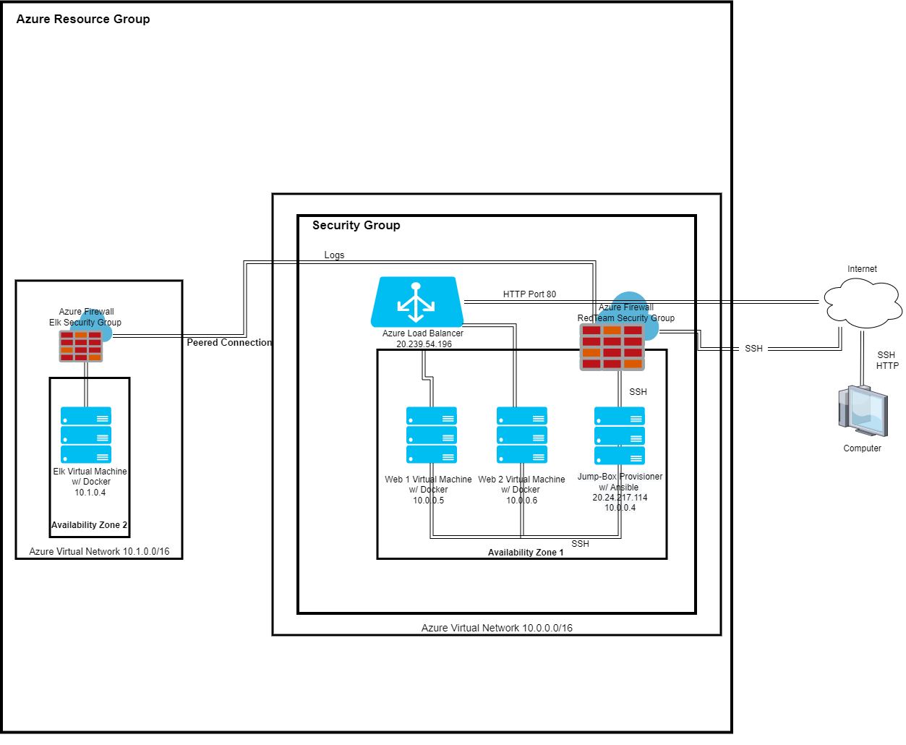

## Automated ELK Stack Deployment

The files in this repository were used to configure the network depicted below.

These files have been tested and used to generate a live ELK deployment on Azure. They can be used to either recreate the entire deployment pictured above. Alternatively, select portions of the playbook.yml file may be used to install only certain pieces of it, such as Filebeat.

This document contains the following details:
- Description of the Topology
- Access Policies
- ELK Configuration
  - Beats in Use
  - Machines Being Monitored
- How to Use the Ansible Build

### Description of the Topology

The main purpose of this network is to expose a load-balanced and monitored instance of DVWA, the D*mn Vulnerable Web Application.

Load balancing ensures that the application will be highly available, in addition to restricting incoming access to the network.
- Load balancers protect the availability of the server. An advantage of a load balancer ensures that the incoming traffic will be equally shared between both of the servers. An advantage of a jump box within a network offers a higher level of security by limiting points of entry.

Integrating an ELK server allows users to easily monitor the vulnerable VMs for changes to the files of the Virtual Machines on the network and system metrics.
- Filebeat monitors log files and collects log events and forwards them to Elasticsearch or Logstash.
- Metricbeat records metrics from the system and services running on the server.

The configuration details of each machine may be found below.

| Name         | Function      | IP Address   | Operating System  |
|--------------|---------------|--------------|-------------------|
| Jump Box     | Gateway       | 10.0.0.4     | Linux             |
| Web 1        | Web Server    | 10.0.0.5     | Linux             |
| Web 2        | Web Server    | 10.0.0.6     | Linux             |
| ELK          | Monitoring    | 10.1.0.4     | Linux             |

Azure has provisioned a load balancer in front of all machines except for the jump box. The load balancer's targets are partitioned into the following availability zones:
Availability Zone #1: Web 1 + Web 2
Availability Zone #2: ELK

### Access Policies

The machines on the internal network are not exposed to the public Internet.

Only the Jump Box machine can accept connections from the Internet. Access to this machine is only allowed from the following IP addresses:
- 50.38.44.55 (Current Public IP Address)

Machines within the network can only be accessed by each other.
- Jump box has access to the ELK VM, and the IP address is 10.0.0.4.

A summary of the access policies in place can be found in the table below.

| Name     | Publicly Accessible | Allowed IP Addresses |
|----------|---------------------|----------------------|
| Jump Box | Yes                 | 50.38.44.55          |
| ELK      | No                  | 10.1.0.4             |
| Web 1    | No                  | 10.0.0.5             |
| Web 2    | No                  | 10.0.0.6             |

### Elk Configuration

Ansible was used to automate configuration of the ELK machine. No configuration was performed manually, which is advantageous because it saves time, reduces chance for user error.  

The playbook implements the following tasks:
-Enables and configures docker module  
-Downloads and installs Filebeat and Metricbeat
-Starts services for Filebeat and Metricbeat  

The following screenshot displays the result of running `docker ps` after successfully configuring the ELK instance.

### Target Machines & Beats
This ELK server is configured to monitor the following machines:
-10.0.0.5
-10.0.0.6

We have installed the following Beats on these machines:
-Metricbeat and Filebeat

These Beats allow us to collect the following information from each machine:
-Metricbeat: collects information related to system metrics, including CPU usage, and services running on the machine.
-Filebeat: monitors changes to the filesystem, specifically apache logs, and forwards them to Elasticsearch or Logstash for analysis.

### Using the Playbook
In order to use the playbook, you will need to have an Ansible control node already configured. Assuming you have such a control node provisioned:

SSH into the control node and follow the steps below:
- Copy the playbook file to ansible control mode.
- Update the host file to include groups and IP's.
- Run the playbook, and navigate to http://20.213.119.40:5601/ to check that the installation worked as expected.

-Which file is the playbook?  filebeat-playbook.yml, metricbeat-playbook.yml, install_elk.yml  
-Where do you copy it? Copy the playbooks to the Ansible Control Node.
-Which file do you update to make Ansible run the playbook on a specific machine? /etc/hosts -include the IP of each server, with each group name
How do I specify which machine to install the ELK server on versus which to install Filebeat on?
-use command(s):
$ cd /etc/ansible
$ ansible-playbook install_elk.yml elk
$ ansible-playbook install_filebeat.yml webservers
$ ansible-playbook install_metricbeat.yml webservers

In order to check that the ELK server is running, run the following command from the ansible server:
-curl http://10.1.0.4:5601/
